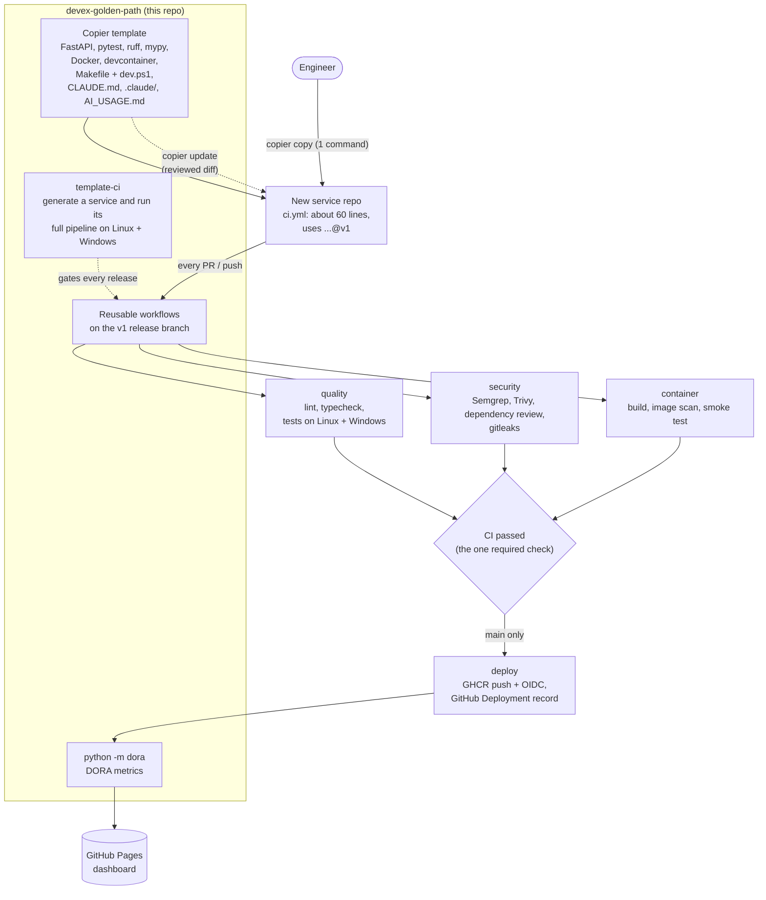

# devex-golden-path

[](https://github.com/RidhanPar/devex-golden-path/actions/workflows/template-ci.yml)
[](https://ridhanpar.github.io/devex-golden-path/)

A **golden path** for a small engineering organisation: how a Developer Experience team makes
engineers faster *and* safer. One command creates a production-ready Python service. Every
service shares one versioned CI/CD pipeline with security gates. And the whole thing is
**measured**: with deliberate breakage, DORA metrics and timed experiments. Every number below
comes from a script in this repository that you can rerun.

**Live:** [DORA dashboard](https://ridhanpar.github.io/devex-golden-path/) ·
[demo service built from the template](https://github.com/RidhanPar/golden-path-demo-service) ·
[gate-proof pull requests](https://github.com/RidhanPar/golden-path-demo-service/pulls?q=is%3Apr+%22gate+proof%22)

## The problem

In a small organisation every new service starts with a day or two of plumbing: tests,
linting, Docker, CI, and maybe security scanning, if someone remembers. Each team does it
differently, so fixes and new safety checks have to be made 30 times, and some never are.
At the same time, AI coding tools are arriving with no shared rules about secrets, review or
testing.

## The golden path in one picture



## Quickstart

Prerequisites: Python 3.12+, git, [uv](https://docs.astral.sh/uv/) (for `uvx`) and the
GitHub CLI if you want to push.

**Linux / macOS**

```bash
uvx copier copy --trust gh:RidhanPar/devex-golden-path my-service
cd my-service && git init
make setup        # .venv, dependencies, pre-commit hooks
make check        # lint + strict typecheck + tests with coverage threshold
make run          # http://127.0.0.1:8000/docs
```

**Windows (PowerShell)**

```powershell
uvx copier copy --trust gh:RidhanPar/devex-golden-path my-service
cd my-service; git init
./dev.ps1 setup
./dev.ps1 check
./dev.ps1 run
```

Push it to GitHub, then protect `main` (it also enables the dependency graph the
dependency-review gate needs):

```bash
gh repo create OWNER/my-service --public --source . --push
python scripts/apply_branch_protection.py OWNER/my-service
```

Later template improvements arrive as a normal, reviewable diff:
`copier update --trust --vcs-ref v1.1.1` (see [docs/releasing.md](docs/releasing.md)).

## Security gates: what each one catches

Every gate blocks the merge through the single required check `CI passed`. Each was proven
by a real pull request that deliberately broke it
([docs/gate-proof.md](docs/gate-proof.md), `python scripts/prove_gates.py OWNER/REPO`):

| Gate | Tool | Catches | Proven by |
|---|---|---|---|
| Lint + format | ruff (incl. bandit-style `S` rules) | Style, common bugs, some insecure patterns | [PR #20](https://github.com/RidhanPar/golden-path-demo-service/pull/20): `shell=True` (S602), also caught by SAST |
| Type check | mypy `--strict` | Type errors that tests miss | [PR #22](https://github.com/RidhanPar/golden-path-demo-service/pull/22): function returned a method, not a `str` |
| Tests | pytest + 80% coverage, **Linux and Windows** | Behaviour regressions | [PR #21](https://github.com/RidhanPar/golden-path-demo-service/pull/21): failed on both OSes |
| SAST | Semgrep (`p/python`, `p/dockerfile`) | Insecure code patterns | [PR #20](https://github.com/RidhanPar/golden-path-demo-service/pull/20): shell injection via `subprocess(..., shell=True)` |
| SCA | Trivy filesystem scan | Known CVEs in pinned dependencies | [PR #19](https://github.com/RidhanPar/golden-path-demo-service/pull/19): `urllib3==1.24.1` |
| Dependency review | GitHub dependency review (PRs) | Vulnerable dependencies a PR introduces | [PR #19](https://github.com/RidhanPar/golden-path-demo-service/pull/19) |
| Secrets | gitleaks (PR commits; also pre-commit) | Committed credentials | [PR #18](https://github.com/RidhanPar/golden-path-demo-service/pull/18): hard-coded API key |
| Container | Buildx + Trivy image scan + smoke test | OS/library CVEs in the image; an image that doesn't start | [PR #19](https://github.com/RidhanPar/golden-path-demo-service/pull/19); first real run found 4 HIGH CVEs in the base image's pip |
| Control | — | Proves the gates don't block everything | [PR #17](https://github.com/RidhanPar/golden-path-demo-service/pull/17): harmless change, all green, mergeable |

Supply chain of the pipeline itself: every action is pinned to a commit SHA, every scanner
image to a digest, and deploys use OIDC with no stored cloud keys
([docs/deploy-oidc.md](docs/deploy-oidc.md)). Why these gates, and how CI stays fast:
[ADR 0002](docs/adr/0002-security-gates-and-fast-ci.md).

## Measured results

All from 2026-10-06/07, on GitHub-hosted runners. Raw data is in [`results/`](results/).

**Developer experience** (`python scripts/measure_dx.py ...`, see
[docs/dx-measurements.md](docs/dx-measurements.md)):

| | Golden path | Hand-made baseline |
|---|---|---|
| Files / lines a human writes to start | **0 / 0** (one command) | 7 / 40 |
| What the path provides instead | 25 files, 644 lines + 509 lines of shared workflows | — |
| Gates on the first CI run | **9** (lint, typecheck, tests, Windows tests, SAST, dependency scan, secret scan, container build + scan, OIDC deploy) | 2 (lint, tests) |
| Start to first CI result (machine time) | 146.8 s (green) | 26.6 s (green) |
| of which CI wall-clock | 121 s | 15 s |

**CI speed: measure, fix, re-measure** (3 uncached/cached pairs after a warm-up, medians,
[docs/dx-measurements.md](docs/dx-measurements.md)):

| | v1.1.1, no cache | v1.1.1, cached | v1.2.0, cached |
|---|---|---|---|
| Total runner time | 208 s | 181 s | **158 s (−24%)** |
| Wall-clock | 63 s | 61 s | **50 s (−21%)** |
| Semgrep job | 30 s | 35 s | **19 s** |

1. Caching alone (v1.1.1) cut runner time 13%, but **wall-clock barely moved**. Jobs run in
   parallel, and Semgrep had become the critical path.
2. Step timings showed **19 of Semgrep's ~22 seconds were pulling its container image**; the
   scan itself took ~1.5 s.
3. v1.2.0 installs Semgrep from its pinned PyPI release with a uv cache. Re-running the same
   experiment: the Semgrep job went 35 → 19 s and wall-clock 61 → 50 s. The critical path is now
   the Windows test job (~40 s), the next candidate.

**Gate proof:** 5 of 5 deliberate breakages blocked by the expected gates; the control PR
passed. (GitGuardian, an app on my account, also flagged the secret; it's reported
separately and not counted.) The first proof run also caught a flaw in the setup: dependency review fails on every
PR when a new repo's dependency graph is off. The setup script now enables it
([run-1 data](results/gate-proof-run1-dependency-graph-off.json)).

**DORA metrics** for my own public repositories (`python -m dora --owner RidhanPar --exclude
'^dx-measure-'`, live on the [dashboard](https://ridhanpar.github.io/devex-golden-path/), snapshot
in [`results/dora-2026-10-07.json`](results/dora-2026-10-07.json)): 35 repositories scanned, 9
have deployment data, and 3 deployed in the 90-day window: 13 successful out of 14 attempts.
That gives **1.0 deploys/week, median lead time 14 s, change failure rate 7% (1 of 14), median
time to restore 8 min**. The one failure is real: the demo service's first deploy hit the
token-permissions bug, and the next deploy restored it 8 minutes later. These are small
numbers from a personal portfolio, and most deployments come from a Vercel site whose lead
times are a lower bound. Definitions and limits: [docs/dora-metrics.md](docs/dora-metrics.md).

## Repository map

| Path | What |
|---|---|
| [`copier.yml`](copier.yml), [`template/`](template/) | The service template |
| [`.github/workflows/reusable-*.yml`](.github/workflows/) | The shared pipeline every service calls |
| [`.github/workflows/template-ci.yml`](.github/workflows/template-ci.yml) | Generates a fresh service per change and runs its developer loop + full pipeline on Linux and Windows |
| [`dora/`](dora/), [`dora-dashboard.yml`](.github/workflows/dora-dashboard.yml) | DORA metrics tool and weekly Pages publish |
| [`scripts/`](scripts/) | `apply_branch_protection.py`, `prove_gates.py`, `measure_dx.py`, `release.py` |
| [`measure/handmade-baseline/`](measure/handmade-baseline/) | The "before" service used for comparison |
| [`docs/`](docs/) | Branch protection, OIDC deploy, releasing, DORA definitions, gate proof, DX measurements |
| [`docs/adr/`](docs/adr/) | [0001 golden path optional](docs/adr/0001-golden-path-is-optional.md) · [0002 gates and fast CI](docs/adr/0002-security-gates-and-fast-ci.md) · [0003 AI coding tools](docs/adr/0003-rolling-out-ai-coding-tools.md) |

## Things the build itself taught (each one is now fixed and documented)

1. The first real service run found **4 HIGH CVEs** in libraries vendored inside the base
   image's `pip`, which a running service never needs. Fix: the runtime image ships without pip.
2. A **called workflow's top-level `permissions` caps the token**, whatever the caller grants.
   The deploy job had only `contents: read` until permissions were declared at job level.
3. **Copier reads every git tag as a version**, so a floating `v1` tag made updates to `v1.1.1`
   look like a downgrade. The shared workflows now live on a fast-forward-only `v1`
   *branch*, and template versions are immutable tags ([docs/releasing.md](docs/releasing.md)).
4. **New repositories don't have the dependency graph on**, so dependency review blocked
   every PR. The control PR exposed it, and the setup script now fixes it.
5. **Caching didn't make CI faster to wait for**, because the slowest parallel job (Semgrep)
   was spending its time pulling an image. Installing it from PyPI cut wall-clock by 18%.

## Honest limitations

- **One organisation of one.** This was built and measured on a personal account. Nothing
  here is measured on real teams, and team-level effects (review load, adoption, onboarding
  time) are untested.
- **Human time is not measured.** The time-to-green experiment measures machine time and
  counts hand-written lines; it can't time a person writing them. On machine time alone the
  golden path is *slower* (147 s vs 27 s) because it runs 9 gates instead of 2. The win is
  what you don't have to write or maintain, and what gets caught.
- **Small samples.** Time-to-green was measured once per path, and each caching arm 3 times.
  CI timings vary with runner load (one cached run took 84 s against a median of 50 s). Rerun
  the scripts for more samples.
- **Deploy target is not a real cloud.** The deploy pushes an image to GHCR and proves the
  OIDC token. The Cloud Run step is documented but **not applied**
  ([docs/deploy-oidc.md](docs/deploy-oidc.md)).
- **DORA data is thin and host-shaped**, as described above. There's no incident data, so
  change failure rate and time to restore can only undercount.
- **Python only.** Other stacks would need their own templates. The reusable security and
  container workflows are mostly language-agnostic.
- **The devcontainer is not exercised in CI.**
- **AI guardrails are client-side.** The `.claude/` deny rules are defence in depth, not a
  guarantee ([ADR 0003](docs/adr/0003-rolling-out-ai-coding-tools.md)).
- Measurement repositories (`dx-measure-*`) remain public as evidence. One extra,
  `dx-measure-golden-20261007063510`, is from a run whose results were lost when the
  script crashed on the hand-made half (a stray `.pyc` file); it is not counted anywhere.
