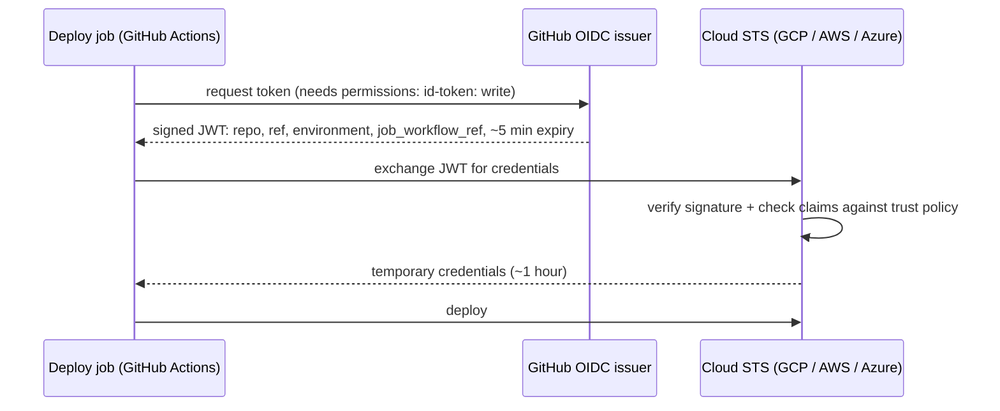

# Deploying with GitHub OIDC (no long-lived cloud keys)

## The problem

The traditional way to let CI deploy is to create a cloud access key and paste it into a
repository secret. That key lives for months or years, works from anywhere, is copied into
every repository that deploys, and is exactly what attackers look for in leaked logs and
compromised CI systems.

## The approach

GitHub Actions can issue each job a short-lived, signed **OIDC token** (a JWT) that says
*who* is asking: which repository, branch, environment and workflow. The cloud is configured
once to trust GitHub's issuer and to exchange tokens **that match specific claims** for
temporary credentials (valid about an hour). Nothing long-lived is stored in GitHub.



## What this repository applies, and what it doesn't

| Step in `reusable-deploy.yml` | Status |
|---|---|
| Runs in the `production` GitHub Environment, so GitHub records a Deployment per release | **Applied** |
| Pushes the image to `ghcr.io/<owner>/<service>` with the job's short-lived `GITHUB_TOKEN` | **Applied** |
| Requests an OIDC token and prints its claims (never the token) | **Applied** |
| Exchanges the token for Google Cloud credentials and deploys to Cloud Run | **Not applied.** No cloud account is connected to this portfolio. Runs only when `gcp-workload-identity-provider` is passed. |

The claims printed by the applied step are visible in the deploy job log of the demo service
(see the README for the link). Their shape:

```json
{
  "iss": "https://token.actions.githubusercontent.com",
  "aud": "golden-path-deploy",
  "sub": "repo:OWNER/SERVICE:environment:production",
  "repository": "OWNER/SERVICE",
  "ref": "refs/heads/main",
  "environment": "production",
  "job_workflow_ref": "RidhanPar/devex-golden-path/.github/workflows/reusable-deploy.yml@refs/tags/v1"
}
```

`job_workflow_ref` is the key claim for a platform team. A trust policy can require that the
token came from **the golden path's reviewed deploy workflow**, not from any workflow someone
writes in a service repository. That way a service can't push to production without going
through the shared gates.

## Connecting Google Cloud (not applied; the steps you would run)

```bash
PROJECT_ID=my-project
PROJECT_NUM=$(gcloud projects describe "$PROJECT_ID" --format='value(projectNumber)')

gcloud iam workload-identity-pools create github --location=global

gcloud iam workload-identity-pools providers create-oidc golden-path \
  --location=global --workload-identity-pool=github \
  --issuer-uri=https://token.actions.githubusercontent.com \
  --attribute-mapping=google.subject=assertion.sub,attribute.repository=assertion.repository \
  --attribute-condition="assertion.repository_owner == 'RidhanPar' && assertion.environment == 'production' && assertion.job_workflow_ref.startsWith('RidhanPar/devex-golden-path/.github/workflows/reusable-deploy.yml@refs/tags/v')"

gcloud iam service-accounts create deployer
gcloud projects add-iam-policy-binding "$PROJECT_ID" \
  --member="serviceAccount:deployer@$PROJECT_ID.iam.gserviceaccount.com" --role=roles/run.developer
gcloud iam service-accounts add-iam-policy-binding "deployer@$PROJECT_ID.iam.gserviceaccount.com" \
  --role=roles/iam.workloadIdentityUser \
  --member="principalSet://iam.googleapis.com/projects/$PROJECT_NUM/locations/global/workloadIdentityPools/github/attribute.repository/RidhanPar/SERVICE"
```

Then pass `gcp-workload-identity-provider` and `gcp-service-account` to the deploy job in the
service's `ci.yml`. These are identifiers, not secrets. Cloud Run can't pull from ghcr.io
directly; you'd add an Artifact Registry *remote repository* that proxies ghcr.io and deploy
the image through it.

The AWS equivalent is an IAM OIDC provider for `token.actions.githubusercontent.com` plus a
role whose trust policy has `StringEquals` on `token.actions.githubusercontent.com:sub` and
`StringLike` on `job_workflow_ref`, used through `aws-actions/configure-aws-credentials`.
